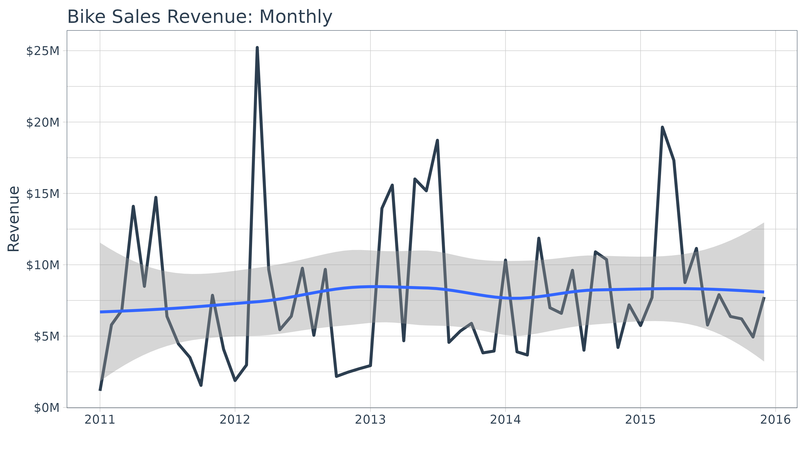
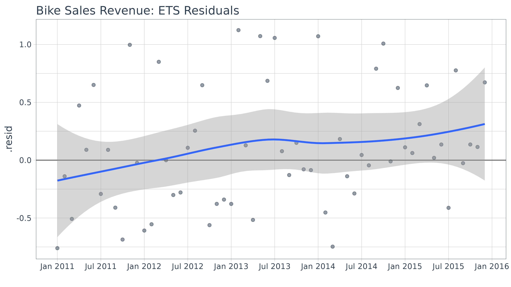
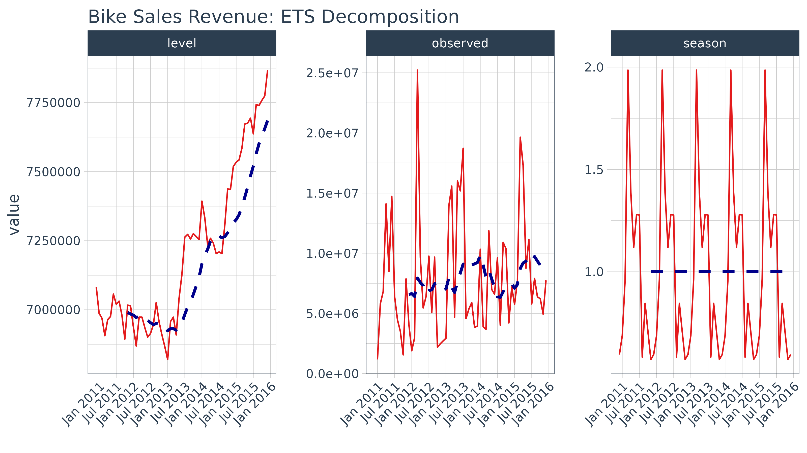
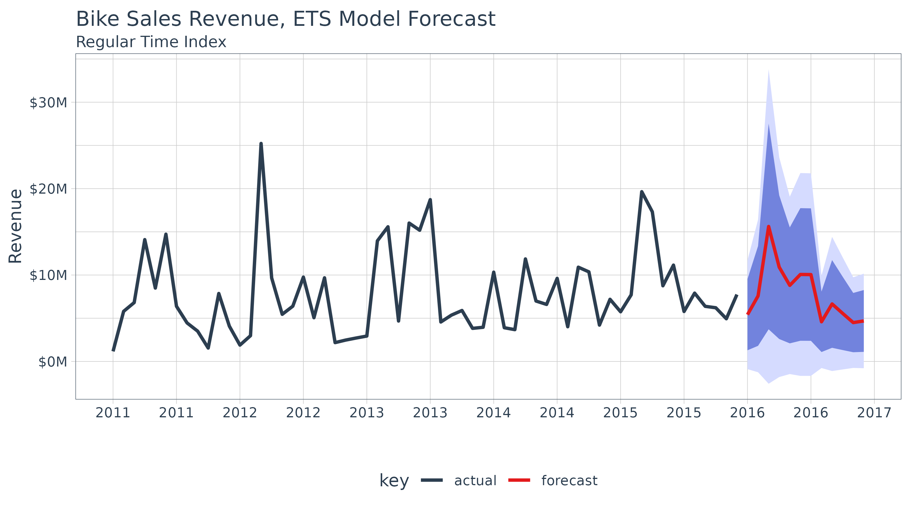
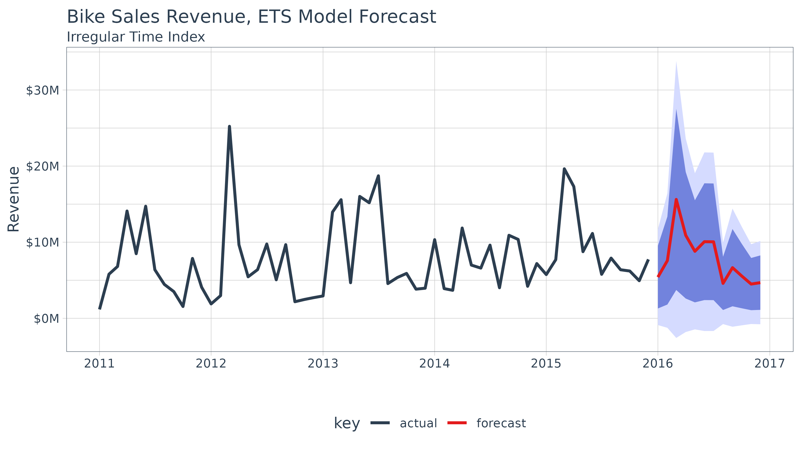

# Introduction to sweep

> Extending `broom` to time series forecasting

The `sweep` package extends the `broom` tools (tidy, glance, and
augment) for performing forecasts and time series analysis in the
“tidyverse”. The package is geared towards the workflow required to
perform forecasts using Rob Hyndman’s `forecast` package, and contains
the following elements:

1.  **model tidiers**: `sw_tidy`, `sw_glance`, `sw_augment`,
    `sw_tidy_decomp` functions extend `tidy`, `glance`, and `augment`
    from the `broom` package specifically for models
    ([`ets()`](https://pkg.robjhyndman.com/forecast/reference/ets.html),
    [`Arima()`](https://pkg.robjhyndman.com/forecast/reference/Arima.html),
    [`bats()`](https://pkg.robjhyndman.com/forecast/reference/bats.html),
    etc) used for forecasting.

2.  **forecast tidier**: `sw_sweep` converts a `forecast` object to a
    tibble that can be easily manipulated in the “tidyverse”.

To illustrate, let’s take a basic forecasting workflow starting from
data collected in a tibble format and then performing a forecast to
achieve the end result in tibble format.

## Prerequisites

Before we get started, load the following packages.

``` r
library(ggplot2)
library(tidyquant)
library(timetk)
library(sweep)
library(forecast)
```

## Forecasting Monthly Bike Sales Revenue

We’ll use the `bike_sales` data set that ships with `sweep` and
aggregate it to monthly revenue. This gives us a local, reproducible
series with both seasonality and trend.

``` r
monthly_sales_tbl <- bike_sales %>%
    dplyr::mutate(date = lubridate::floor_date(order.date, unit = "month")) %>%
    dplyr::group_by(date) %>%
    dplyr::summarise(price = sum(price.ext), .groups = "drop")
monthly_sales_tbl
```

    ## # A tibble: 60 × 2
    ##    date          price
    ##    <date>        <dbl>
    ##  1 2011-01-01  1165365
    ##  2 2011-02-01  5794945
    ##  3 2011-03-01  6811655
    ##  4 2011-04-01 14097770
    ##  5 2011-05-01  8488650
    ##  6 2011-06-01 14725405
    ##  7 2011-07-01  6382930
    ##  8 2011-08-01  4456670
    ##  9 2011-09-01  3505000
    ## 10 2011-10-01  1548640
    ## # ℹ 50 more rows

We can quickly visualize using the `ggplot2` package. We can see that
there appears to be some seasonality and an upward trend.

``` r
monthly_sales_tbl %>%
    ggplot(aes(x = date, y = price)) +
    geom_line(linewidth = 1, color = palette_light()[[1]]) +
    geom_smooth(method = "loess") +
    labs(title = "Bike Sales Revenue: Monthly", x = "", y = "Revenue") +
    scale_y_continuous(labels = scales::label_dollar(scale = 1 / 1000000, suffix = "M")) +
    scale_x_date(date_breaks = "1 year", date_labels = "%Y") +
    theme_tq()
```

    ## `geom_smooth()` using formula = 'y ~ x'



## Forecasting Workflow

The forecasting workflow involves a few basic steps:

1.  Step 1: Coerce to a `ts` object class.
2.  Step 2: Apply a model (or set of models)
3.  Step 3: Forecast the models (similar to predict)
4.  Step 4: Use
    [`sw_sweep()`](https://business-science.github.io/sweep/reference/sw_sweep.md)
    to tidy the forecast.

*Note that we purposely omit other steps such as testing the series for
stationarity (`Box.test(type = "Ljung")`) and analysis of
autocorrelations (`Acf`, `Pacf`) for brevity purposes. We recommend the
analyst to follow the forecasting workflow in [“Forecasting: principles
and practice”](https://otexts.com/fpp2/)*

### Step 1: Coerce to a `ts` object class

The `forecast` package uses the `ts` data structure, which is quite a
bit different than tibbles that we are currently using. Fortunately,
it’s easy to get to the correct structure with
[`tk_ts()`](https://business-science.github.io/timetk/reference/tk_ts.html)
from the `timetk` package. The `start` and `freq` variables are required
for the regularized time series (`ts`) class, and these specify how to
treat the time series. For monthly, the frequency should be specified as
12. This results in a nice calendar view. The `silent = TRUE` tells the
[`tk_ts()`](https://business-science.github.io/timetk/reference/tk_ts.html)
function to skip the warning notifying us that the “date” column is
being dropped. Non-numeric columns must be dropped for `ts` class, which
is matrix based and a homogeneous data class.

``` r
monthly_sales_ts <- tk_ts(monthly_sales_tbl, start = 2011, freq = 12, silent = TRUE)
monthly_sales_ts
```

    ##           Jan      Feb      Mar      Apr      May      Jun      Jul      Aug
    ## 2011  1165365  5794945  6811655 14097770  8488650 14725405  6382930  4456670
    ## 2012  1889200  2980110 25227175  9665115  5451530  6394690  9758130  5058110
    ## 2013  2936430 13956420 15584435  4674935 16013425 15182715 18724435  4562175
    ## 2014 10331390  3901295  3678090 11862535  6990325  6596090  9613175  4013970
    ## 2015  5745235  7706725 19645635 17314555  8753325 11146845  5778445  7906480
    ##           Sep      Oct      Nov      Dec
    ## 2011  3505000  1548640  7863725  4081460
    ## 2012  9678210  2177455  2472045  2711705
    ## 2013  5358180  5896440  3827600  3953565
    ## 2014 10907310 10365720  4204590  7190935
    ## 2015  6377295  6211815  4938465  7740870

A significant benefit is that the resulting `ts` object maintains a
“timetk index”, which will help with forecasting dates later. We can
verify this using
[`has_timetk_idx()`](https://business-science.github.io/timetk/reference/tk_index.html)
from the `timetk` package.

``` r
has_timetk_idx(monthly_sales_ts)
```

    ## [1] TRUE

Now that a time series has been coerced, let’s proceed with modeling.

### Step 2: Modeling a time series

The modeling workflow takes a time series object and applies a model.
Nothing new here: we’ll simply use the
[`ets()`](https://pkg.robjhyndman.com/forecast/reference/ets.html)
function from the `forecast` package to get an Exponential Smoothing ETS
(Error, Trend, Seasonal) model.

``` r
fit_ets <- monthly_sales_ts %>%
    ets()
```

Where `sweep` can help is in the evaluation of a model. Expanding on the
`broom` package there are four functions:

- [`sw_tidy()`](https://business-science.github.io/sweep/reference/sw_tidy.md):
  Returns a tibble of model parameters
- [`sw_glance()`](https://business-science.github.io/sweep/reference/sw_glance.md):
  Returns the model accuracy measurements
- [`sw_augment()`](https://business-science.github.io/sweep/reference/sw_augment.md):
  Returns the fitted and residuals of the model
- [`sw_tidy_decomp()`](https://business-science.github.io/sweep/reference/sw_tidy_decomp.md):
  Returns a tidy decomposition from a model

The guide below shows which model object compatibility with `sweep`
tidier functions.

| Object      | sw_tidy() | sw_glance() | sw_augment() | sw_tidy_decomp() | sw_sweep() |
|:------------|:---------:|:-----------:|:------------:|:----------------:|:----------:|
| ar          |           |             |              |                  |            |
| arima       |     X     |      X      |      X       |                  |            |
| Arima       |     X     |      X      |      X       |                  |            |
| ets         |     X     |      X      |      X       |        X         |            |
| baggedETS   |           |             |              |                  |            |
| bats        |     X     |      X      |      X       |        X         |            |
| tbats       |     X     |      X      |      X       |        X         |            |
| nnetar      |     X     |      X      |      X       |                  |            |
| stl         |           |             |              |        X         |            |
| HoltWinters |     X     |      X      |      X       |        X         |            |
| StructTS    |     X     |      X      |      X       |        X         |            |
| tslm        |     X     |      X      |      X       |                  |            |
| decompose   |           |             |              |        X         |            |
| adf.test    |     X     |      X      |              |                  |            |
| Box.test    |     X     |      X      |              |                  |            |
| kpss.test   |     X     |      X      |              |                  |            |
| forecast    |           |             |              |                  |     X      |

Function Compatibility

Going through the tidiers, we can get useful `model` information.

#### sw_tidy

[`sw_tidy()`](https://business-science.github.io/sweep/reference/sw_tidy.md)
returns the model parameters.

``` r
sw_tidy(fit_ets)
```

    ## # A tibble: 14 × 2
    ##    term  estimate
    ##    <chr>    <dbl>
    ##  1 alpha  1.79e-2
    ##  2 gamma  1.00e-4
    ##  3 l      7.08e+6
    ##  4 s0     5.95e-1
    ##  5 s1     5.71e-1
    ##  6 s2     7.07e-1
    ##  7 s3     8.46e-1
    ##  8 s4     5.83e-1
    ##  9 s5     1.28e+0
    ## 10 s6     1.28e+0
    ## 11 s7     1.12e+0
    ## 12 s8     1.39e+0
    ## 13 s9     1.99e+0
    ## 14 s10    9.64e-1

#### sw_glance

[`sw_glance()`](https://business-science.github.io/sweep/reference/sw_glance.md)
returns the model quality parameters.

``` r
sw_glance(fit_ets)
```

    ## # A tibble: 1 × 12
    ##   model.desc sigma logLik   AIC   BIC      ME     RMSE     MAE   MPE  MAPE  MASE
    ##   <chr>      <dbl>  <dbl> <dbl> <dbl>   <dbl>    <dbl>   <dbl> <dbl> <dbl> <dbl>
    ## 1 ETS(M,N,M) 0.594 -1026. 2083. 2114. 686483. 4038152.  2.95e6 -20.0  49.5 0.561
    ## # ℹ 1 more variable: ACF1 <dbl>

#### sw_augment

[`sw_augment()`](https://business-science.github.io/sweep/reference/sw_augment.md)
returns the actual, fitted and residual values.

``` r
augment_fit_ets <- sw_augment(fit_ets)
augment_fit_ets
```

    ## # A tibble: 60 × 4
    ##    index      .actual   .fitted  .resid
    ##    <yearmon>    <dbl>     <dbl>   <dbl>
    ##  1 Jan 2011   1165365  4872020. -0.761 
    ##  2 Feb 2011   5794945  6731901. -0.139 
    ##  3 Mar 2011   6811655 13836628. -0.508 
    ##  4 Apr 2011  14097770  9574494.  0.472 
    ##  5 May 2011   8488650  7790402.  0.0896
    ##  6 Jun 2011  14725405  8922332.  0.650 
    ##  7 Jul 2011   6382930  9013625. -0.292 
    ##  8 Aug 2011   4456670  4091929.  0.0891
    ##  9 Sep 2011   3505000  5944932. -0.410 
    ## 10 Oct 2011   1548640  4933041. -0.686 
    ## # ℹ 50 more rows

We can review the residuals to determine if their are any underlying
patterns left. Note that the index is class `yearmon`, which is a
regularized date format.

``` r
augment_fit_ets %>%
    ggplot(aes(x = index, y = .resid)) +
    geom_hline(yintercept = 0, color = "grey40") +
    geom_point(color = palette_light()[[1]], alpha = 0.5) +
    geom_smooth(method = "loess") +
    scale_x_yearmon(n = 10) +
    labs(title = "Bike Sales Revenue: ETS Residuals", x = "") + 
    theme_tq()
```

    ## `geom_smooth()` using formula = 'y ~ x'



#### sw_tidy_decomp

[`sw_tidy_decomp()`](https://business-science.github.io/sweep/reference/sw_tidy_decomp.md)
returns the decomposition of the ETS model.

``` r
decomp_fit_ets <- sw_tidy_decomp(fit_ets)
decomp_fit_ets 
```

    ## # A tibble: 61 × 4
    ##    index     observed    level season
    ##    <yearmon>    <dbl>    <dbl>  <dbl>
    ##  1 Dec 2010        NA 7083284.  0.595
    ##  2 Jan 2011   1165365 6986708.  0.688
    ##  3 Feb 2011   5794945 6969282.  0.964
    ##  4 Mar 2011   6811655 6905871.  1.99 
    ##  5 Apr 2011  14097770 6964339.  1.39 
    ##  6 May 2011   8488650 6975525.  1.12 
    ##  7 Jun 2011  14725405 7056830.  1.28 
    ##  8 Jul 2011   6382930 7019920.  1.28 
    ##  9 Aug 2011   4456670 7031134.  0.583
    ## 10 Sep 2011   3505000 6979419.  0.845
    ## # ℹ 51 more rows

We can review the decomposition using `ggplot2` as well. The data will
need to be manipulated slightly for the facet visualization. The
`gather()` function from the `tidyr` package is used to reshape the data
into a long format data frame with column names “key” and “value”
indicating all columns except for index are to be reshaped. The “key”
column is then mutated using
[`mutate()`](https://dplyr.tidyverse.org/reference/mutate.html) to a
factor which preserves the order of the keys so “observed” comes first
when plotting.

``` r
decomp_fit_ets %>%
    tidyr::gather(key = key, value = value, -index) %>%
    dplyr::mutate(key = as.factor(key)) %>%
    ggplot(aes(x = index, y = value, group = key)) +
    geom_line(color = palette_light()[[2]]) +
    geom_ma(ma_fun = SMA, n = 12, size = 1) +
    facet_wrap(~ key, scales = "free_y") +
    scale_x_yearmon(n = 10) +
    labs(title = "Bike Sales Revenue: ETS Decomposition", x = "") + 
    theme_tq() +
    theme(axis.text.x = element_text(angle = 45, hjust = 1))
```

    ## Warning: Using `size` aesthetic for lines was deprecated in ggplot2 3.4.0.
    ## ℹ Please use `linewidth` instead.
    ## ℹ The deprecated feature was likely used in the tidyquant package.
    ##   Please report the issue at
    ##   <https://github.com/business-science/tidyquant/issues>.
    ## This warning is displayed once per session.
    ## Call `lifecycle::last_lifecycle_warnings()` to see where this warning was
    ## generated.

    ## Warning: Removed 1 row containing missing values or values outside the scale range
    ## (`geom_line()`).



Under normal circumstances it would make sense to refine the model at
this point. However, in the interest of showing capabilities (rather
than how to forecast) we move onto forecasting the model. For more
information on how to forecast, please refer to the online book
[*“Forecasting: principles and practices”*](https://otexts.com/fpp2/).

### Step 3: Forecasting the model

Next we forecast the ETS model using the
[`forecast()`](https://generics.r-lib.org/reference/forecast.html)
function. The returned `forecast` object isn’t in a “tidy” format
(i.e. data frame). This is where the
[`sw_sweep()`](https://business-science.github.io/sweep/reference/sw_sweep.md)
function helps.

``` r
fcast_ets <- fit_ets %>%
    forecast(h = 12) 
```

### Step 4: Tidy the forecast object

We’ll use the
[`sw_sweep()`](https://business-science.github.io/sweep/reference/sw_sweep.md)
function to coerce a `forecast` into a “tidy” data frame. The
[`sw_sweep()`](https://business-science.github.io/sweep/reference/sw_sweep.md)
function then coerces the `forecast` object into a tibble that can be
sent to `ggplot` for visualization. Let’s inspect the result.

``` r
sw_sweep(fcast_ets, fitted = TRUE)
```

    ## # A tibble: 132 × 7
    ##    index     key       price lo.80 lo.95 hi.80 hi.95
    ##    <yearmon> <chr>     <dbl> <dbl> <dbl> <dbl> <dbl>
    ##  1 Jan 2011  actual  1165365    NA    NA    NA    NA
    ##  2 Feb 2011  actual  5794945    NA    NA    NA    NA
    ##  3 Mar 2011  actual  6811655    NA    NA    NA    NA
    ##  4 Apr 2011  actual 14097770    NA    NA    NA    NA
    ##  5 May 2011  actual  8488650    NA    NA    NA    NA
    ##  6 Jun 2011  actual 14725405    NA    NA    NA    NA
    ##  7 Jul 2011  actual  6382930    NA    NA    NA    NA
    ##  8 Aug 2011  actual  4456670    NA    NA    NA    NA
    ##  9 Sep 2011  actual  3505000    NA    NA    NA    NA
    ## 10 Oct 2011  actual  1548640    NA    NA    NA    NA
    ## # ℹ 122 more rows

The tibble returned contains “index”, “key” and “value” (or in this case
“price”) columns in a long or “tidy” format that is ideal for
visualization with `ggplot2`. The “index” is in a regularized format (in
this case `yearmon`) because the `forecast` package uses `ts` objects.
We’ll see how we can get back to the original irregularized format (in
this case `date`) later. The “key” and “price” columns contains three
groups of key-value pairs:

1.  **actual**: the actual values from the original data
2.  **fitted**: the model values returned from the
    [`ets()`](https://pkg.robjhyndman.com/forecast/reference/ets.html)
    function (excluded by default)
3.  **forecast**: the predicted values from the
    [`forecast()`](https://generics.r-lib.org/reference/forecast.html)
    function

The
[`sw_sweep()`](https://business-science.github.io/sweep/reference/sw_sweep.md)
function contains an argument `fitted = FALSE` by default meaning that
the model “fitted” values are not returned. We can toggle this on if
desired. The remaining columns are the forecast confidence intervals
(typically 80 and 95, but this can be changed with
`forecast(level = c(80, 95))`). These columns are setup in a wide format
to enable using the
[`geom_ribbon()`](https://ggplot2.tidyverse.org/reference/geom_ribbon.html).

Let’s visualize the forecast with `ggplot2`. We’ll use a combination of
[`geom_line()`](https://ggplot2.tidyverse.org/reference/geom_path.html)
and
[`geom_ribbon()`](https://ggplot2.tidyverse.org/reference/geom_ribbon.html).
The fitted values are toggled off by default to reduce the complexity of
the plot, but these can be added if desired. Note that because we are
using a regular time index of the `yearmon` class, we need to add
`scale_x_yearmon()`.

``` r
sw_sweep(fcast_ets) %>%
    ggplot(aes(x = index, y = price, color = key)) +
    geom_ribbon(aes(ymin = lo.95, ymax = hi.95), 
                fill = "#D5DBFF", color = NA, linewidth = 0) +
    geom_ribbon(aes(ymin = lo.80, ymax = hi.80, fill = key), 
                fill = "#596DD5", color = NA, linewidth = 0, alpha = 0.8) +
    geom_line(linewidth = 1) +
    labs(title = "Bike Sales Revenue, ETS Model Forecast", x = "", y = "Revenue",
         subtitle = "Regular Time Index") +
    scale_y_continuous(labels = scales::label_dollar(scale = 1 / 1000000, suffix = "M")) +
    scale_x_yearmon(n = 12, format = "%Y") +
    scale_color_tq() +
    scale_fill_tq() +
    theme_tq() 
```

    ## Warning: Removed 60 rows containing missing values or values outside the scale range
    ## (`geom_ribbon()`).
    ## Removed 60 rows containing missing values or values outside the scale range
    ## (`geom_ribbon()`).



Because the `ts` object was created with the
[`tk_ts()`](https://business-science.github.io/timetk/reference/tk_ts.html)
function, it contained a timetk index that was carried with it
throughout the forecasting workflow. As a result, we can use the
`timetk_idx` argument, which maps the original irregular index (dates)
and a generated future index to the regularized time series (yearmon).
This results in the ability to return an index of date and datetime,
which is not currently possible with the `forecast` objects. Notice that
the index is returned as `date` class.

``` r
sw_sweep(fcast_ets, timetk_idx = TRUE) %>%
    head()
```

    ## Warning in .check_tzones(e1, e2): 'tzone' attributes are inconsistent

    ## # A tibble: 6 × 7
    ##   index      key       price lo.80 lo.95 hi.80 hi.95
    ##   <date>     <chr>     <dbl> <dbl> <dbl> <dbl> <dbl>
    ## 1 2011-01-01 actual  1165365    NA    NA    NA    NA
    ## 2 2011-02-01 actual  5794945    NA    NA    NA    NA
    ## 3 2011-03-01 actual  6811655    NA    NA    NA    NA
    ## 4 2011-04-01 actual 14097770    NA    NA    NA    NA
    ## 5 2011-05-01 actual  8488650    NA    NA    NA    NA
    ## 6 2011-06-01 actual 14725405    NA    NA    NA    NA

``` r
sw_sweep(fcast_ets, timetk_idx = TRUE) %>%
    tail()
```

    ## Warning in .check_tzones(e1, e2): 'tzone' attributes are inconsistent

    ## # A tibble: 6 × 7
    ##   index      key          price    lo.80     lo.95     hi.80     hi.95
    ##   <date>     <chr>        <dbl>    <dbl>     <dbl>     <dbl>     <dbl>
    ## 1 2016-07-01 forecast 10050244. 2385587. -1671837. 17714901. 21772325.
    ## 2 2016-08-01 forecast  4586811. 1087995.  -764167.  8085627.  9937789.
    ## 3 2016-09-01 forecast  6653105. 1577021. -1110096. 11729189. 14416305.
    ## 4 2016-10-01 forecast  5561120. 1317262.  -929300.  9804977. 12051539.
    ## 5 2016-11-01 forecast  4494948. 1063975.  -752272.  7925920.  9742167.
    ## 6 2016-12-01 forecast  4684854. 1108152.  -785239.  8261557. 10154948.

We can build the same plot with dates in the x-axis now.

``` r
sw_sweep(fcast_ets, timetk_idx = TRUE) %>%
    ggplot(aes(x = index, y = price, color = key)) +
    geom_ribbon(aes(ymin = lo.95, ymax = hi.95), 
                fill = "#D5DBFF", color = NA, linewidth = 0) +
    geom_ribbon(aes(ymin = lo.80, ymax = hi.80, fill = key), 
                fill = "#596DD5", color = NA, linewidth = 0, alpha = 0.8) +
    geom_line(linewidth = 1) +
    labs(title = "Bike Sales Revenue, ETS Model Forecast", x = "", y = "Revenue", 
         subtitle = "Irregular Time Index") +
    scale_y_continuous(labels = scales::label_dollar(scale = 1 / 1000000, suffix = "M")) +
    scale_x_date(date_breaks = "1 year", date_labels = "%Y") +
    scale_color_tq() +
    scale_fill_tq() +
    theme_tq() 
```

    ## Warning in .check_tzones(e1, e2): 'tzone' attributes are inconsistent

    ## Warning: Removed 60 rows containing missing values or values outside the scale range
    ## (`geom_ribbon()`).
    ## Removed 60 rows containing missing values or values outside the scale range
    ## (`geom_ribbon()`).



In this example, there is not much benefit to returning an irregular
time series. However, when working with frequencies below monthly, the
ability to return irregular index values becomes more apparent.

## Recap

This was an overview of how various functions within the `sweep` package
can be used to assist in forecast analysis. In the next vignette, we
discuss some more powerful concepts including forecasting at scale with
grouped time series analysis.
