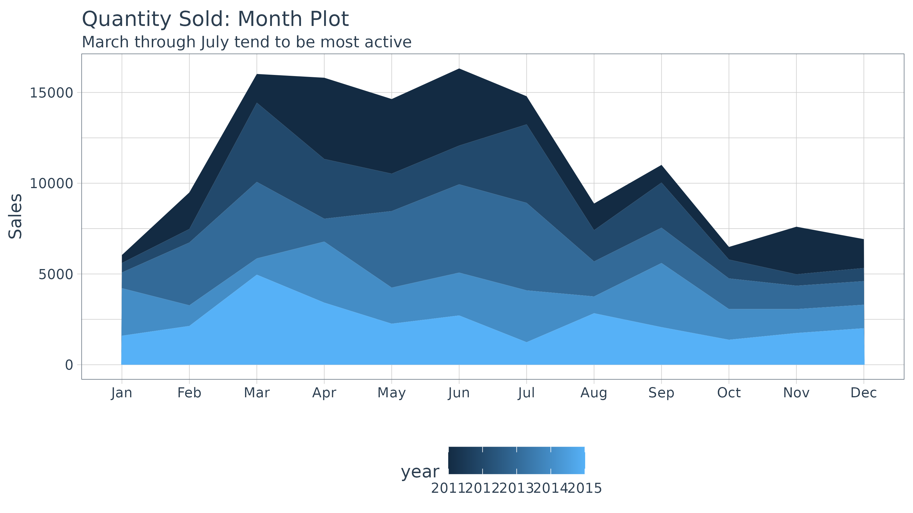
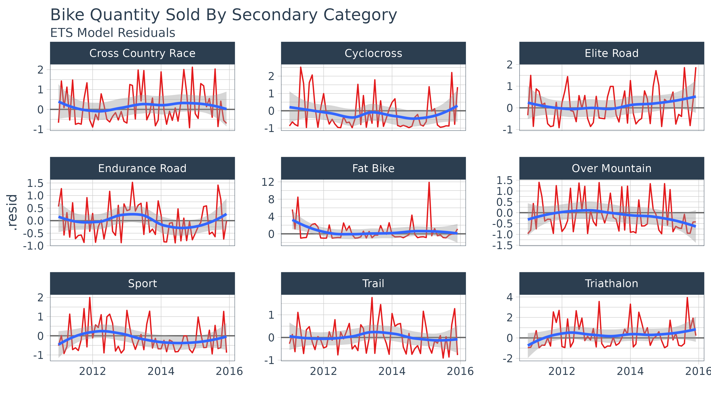
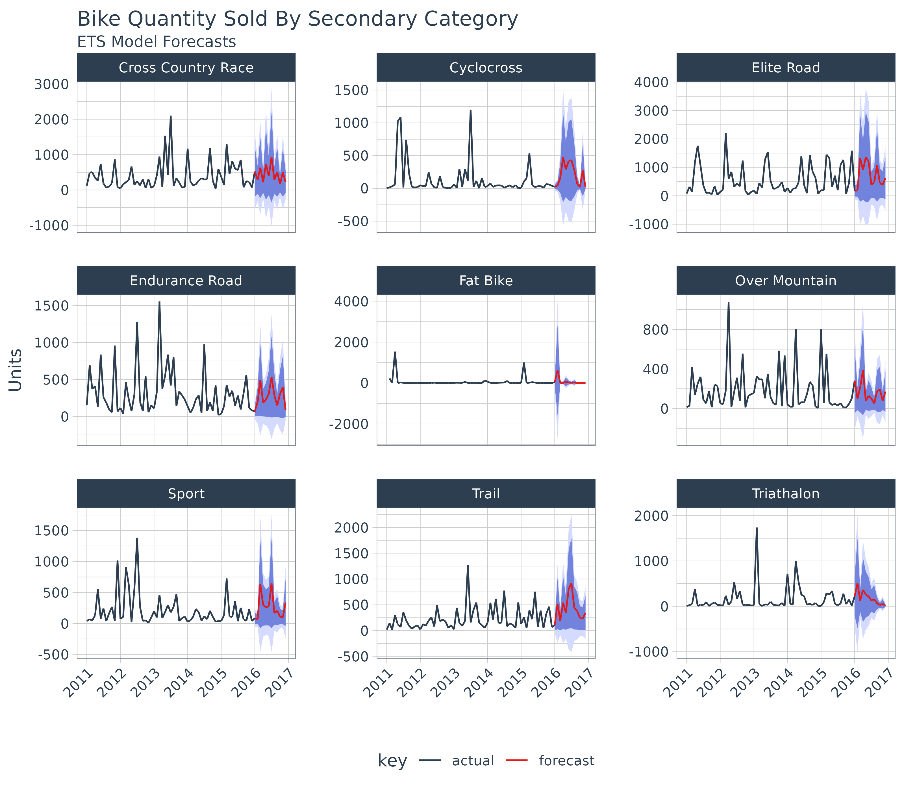

# Forecasting Time Series Groups in the tidyverse

> Extending `broom` to time series forecasting

One of the most powerful benefits of `sweep` is that it helps
forecasting at scale within the “tidyverse”. There are two common
situations:

1.  Applying a model to groups of time series
2.  Applying multiple models to a time series

In this vignette we’ll review how `sweep` can help the **first
situation**: *Applying a model to groups of time series*.

## Prerequisites

Before we get started, load the following packages.

``` r
library(dplyr)
library(ggplot2)
library(tidyr)
library(purrr)
library(lubridate)
library(tidyquant)
library(timetk)
library(sweep)
library(forecast)
```

## Bike Sales

We’ll use the bike sales data set, `bike_sales`, provided with the
`sweep` package for this tutorial. The `bike_sales` data set is a
*fictional* daily order history that spans 2011 through 2015. It
simulates a sales database that is typical of a business. The customers
are the “bike shops” and the products are the “models”.

``` r
bike_sales
```

    ## # A tibble: 15,644 × 17
    ##    order.date order.id order.line quantity price price.ext customer.id
    ##    <date>        <dbl>      <int>    <dbl> <dbl>     <dbl>       <dbl>
    ##  1 2011-01-07        1          1        1  6070      6070           2
    ##  2 2011-01-07        1          2        1  5970      5970           2
    ##  3 2011-01-10        2          1        1  2770      2770          10
    ##  4 2011-01-10        2          2        1  5970      5970          10
    ##  5 2011-01-10        3          1        1 10660     10660           6
    ##  6 2011-01-10        3          2        1  3200      3200           6
    ##  7 2011-01-10        3          3        1 12790     12790           6
    ##  8 2011-01-10        3          4        1  5330      5330           6
    ##  9 2011-01-10        3          5        1  1570      1570           6
    ## 10 2011-01-11        4          1        1  4800      4800          22
    ## # ℹ 15,634 more rows
    ## # ℹ 10 more variables: bikeshop.name <chr>, bikeshop.city <chr>,
    ## #   bikeshop.state <chr>, latitude <dbl>, longitude <dbl>, product.id <dbl>,
    ## #   model <chr>, category.primary <chr>, category.secondary <chr>, frame <chr>

We’ll analyse the monthly sales trends for the bicycle manufacturer.
Let’s transform the data set by aggregating by month.

``` r
bike_sales_monthly <- bike_sales %>%
    mutate(month = month(order.date, label = TRUE),
           year  = year(order.date)) %>%
    group_by(year, month) %>%
    summarise(total.qty = sum(quantity)) 
```

    ## `summarise()` has regrouped the output.
    ## ℹ Summaries were computed grouped by year and month.
    ## ℹ Output is grouped by year.
    ## ℹ Use `summarise(.groups = "drop_last")` to silence this message.
    ## ℹ Use `summarise(.by = c(year, month))` for per-operation grouping
    ##   (`?dplyr::dplyr_by`) instead.

``` r
bike_sales_monthly
```

    ## # A tibble: 60 × 3
    ## # Groups:   year [5]
    ##     year month total.qty
    ##    <dbl> <ord>     <dbl>
    ##  1  2011 Jan         440
    ##  2  2011 Feb        2017
    ##  3  2011 Mar        1584
    ##  4  2011 Apr        4478
    ##  5  2011 May        4112
    ##  6  2011 Jun        4251
    ##  7  2011 Jul        1550
    ##  8  2011 Aug        1470
    ##  9  2011 Sep         975
    ## 10  2011 Oct         697
    ## # ℹ 50 more rows

We can visualize package with a month plot using the `ggplot2` .

``` r
bike_sales_monthly %>%
    ggplot(aes(x = month, y = total.qty, group = year)) +
    geom_area(aes(fill = year), position = "stack") +
    labs(title = "Quantity Sold: Month Plot", x = "", y = "Sales",
         subtitle = "March through July tend to be most active") +
    scale_y_continuous() +
    theme_tq()
```



Suppose Manufacturing wants a more granular forecast because the bike
components are related to the secondary category. In the next section we
discuss how `sweep` can help to perform a forecast on each sub-category.

## Performing Forecasts on Groups

First, we need to get the data organized into groups by month of the
year. We’ll create a new “order.month” date using
[`zoo::as.yearmon()`](https://rdrr.io/pkg/zoo/man/yearmon.html) that
captures the year and month information from the “order.date” and then
passing this to
[`lubridate::as_date()`](https://lubridate.tidyverse.org/reference/as_date.html)
to convert to date format.

``` r
monthly_qty_by_cat2 <- bike_sales %>%
    mutate(order.month = as_date(as.yearmon(order.date))) %>%
    group_by(category.secondary, order.month) %>%
    summarise(total.qty = sum(quantity))
```

    ## `summarise()` has regrouped the output.
    ## ℹ Summaries were computed grouped by category.secondary and order.month.
    ## ℹ Output is grouped by category.secondary.
    ## ℹ Use `summarise(.groups = "drop_last")` to silence this message.
    ## ℹ Use `summarise(.by = c(category.secondary, order.month))` for per-operation
    ##   grouping (`?dplyr::dplyr_by`) instead.

``` r
monthly_qty_by_cat2
```

    ## # A tibble: 538 × 3
    ## # Groups:   category.secondary [9]
    ##    category.secondary order.month total.qty
    ##    <chr>              <date>          <dbl>
    ##  1 Cross Country Race 2011-01-01        122
    ##  2 Cross Country Race 2011-02-01        489
    ##  3 Cross Country Race 2011-03-01        505
    ##  4 Cross Country Race 2011-04-01        343
    ##  5 Cross Country Race 2011-05-01        263
    ##  6 Cross Country Race 2011-06-01        735
    ##  7 Cross Country Race 2011-07-01        183
    ##  8 Cross Country Race 2011-08-01         66
    ##  9 Cross Country Race 2011-09-01         97
    ## 10 Cross Country Race 2011-10-01        189
    ## # ℹ 528 more rows

Next, we use the
[`nest()`](https://tidyr.tidyverse.org/reference/nest.html) function
from the `tidyr` package to consolidate each time series by group. The
newly created list-column, “data.tbl”, contains the “order.month” and
“total.qty” columns by group from the previous step. The
[`nest()`](https://tidyr.tidyverse.org/reference/nest.html) function
just bundles the data together which is very useful for iterative
functional programming.

``` r
monthly_qty_by_cat2_nest <- monthly_qty_by_cat2 %>%
    group_by(category.secondary) %>%
    nest()
monthly_qty_by_cat2_nest
```

    ## # A tibble: 9 × 2
    ## # Groups:   category.secondary [9]
    ##   category.secondary data             
    ##   <chr>              <list>           
    ## 1 Cross Country Race <tibble [60 × 2]>
    ## 2 Cyclocross         <tibble [60 × 2]>
    ## 3 Elite Road         <tibble [60 × 2]>
    ## 4 Endurance Road     <tibble [60 × 2]>
    ## 5 Fat Bike           <tibble [58 × 2]>
    ## 6 Over Mountain      <tibble [60 × 2]>
    ## 7 Sport              <tibble [60 × 2]>
    ## 8 Trail              <tibble [60 × 2]>
    ## 9 Triathalon         <tibble [60 × 2]>

### Forecasting Workflow

The forecasting workflow involves a few basic steps:

1.  Step 1: Coerce to a `ts` object class.
2.  Step 2: Apply a model (or set of models)
3.  Step 3: Forecast the models (similar to predict)
4.  Step 4: Tidy the forecast

### Step 1: Coerce to a `ts` object class

In this step we map the
[`tk_ts()`](https://business-science.github.io/timetk/reference/tk_ts.html)
function into a new column “data.ts”. The procedure is performed using
the combination of
[`dplyr::mutate()`](https://dplyr.tidyverse.org/reference/mutate.html)
and [`purrr::map()`](https://purrr.tidyverse.org/reference/map.html),
which works really well for the data science workflow where analyses are
built progressively. As a result, this combination will be used in many
of the subsequent steps in this vignette as we build the analysis.

#### mutate and map

The [`mutate()`](https://dplyr.tidyverse.org/reference/mutate.html)
function adds a column, and the
[`map()`](https://purrr.tidyverse.org/reference/map.html) function maps
the contents of a list-column (`.x`) to a function (`.f`). In our case,
`.x = data.tbl` and `.f = tk_ts`. The arguments `select = -order.month`,
`start = 2011`, and `freq = 12` are passed to the `...` parameters in
map, which are passed through to the function. The `select` statement is
used to drop the “order.month” from the final output so we don’t get a
bunch of warning messages. We specify `start = 2011` and `freq = 12` to
return a monthly frequency.

``` r
monthly_qty_by_cat2_ts <- monthly_qty_by_cat2_nest %>%
    mutate(data.ts = map(.x       = data, 
                         .f       = tk_ts, 
                         select   = -order.month, 
                         start    = 2011,
                         freq     = 12))
monthly_qty_by_cat2_ts
```

    ## # A tibble: 9 × 3
    ## # Groups:   category.secondary [9]
    ##   category.secondary data              data.ts      
    ##   <chr>              <list>            <list>       
    ## 1 Cross Country Race <tibble [60 × 2]> <ts [60 × 1]>
    ## 2 Cyclocross         <tibble [60 × 2]> <ts [60 × 1]>
    ## 3 Elite Road         <tibble [60 × 2]> <ts [60 × 1]>
    ## 4 Endurance Road     <tibble [60 × 2]> <ts [60 × 1]>
    ## 5 Fat Bike           <tibble [58 × 2]> <ts [58 × 1]>
    ## 6 Over Mountain      <tibble [60 × 2]> <ts [60 × 1]>
    ## 7 Sport              <tibble [60 × 2]> <ts [60 × 1]>
    ## 8 Trail              <tibble [60 × 2]> <ts [60 × 1]>
    ## 9 Triathalon         <tibble [60 × 2]> <ts [60 × 1]>

### Step 2: Modeling a time series

Next, we map the Exponential Smoothing ETS (Error, Trend, Seasonal)
model function, `ets`, from the `forecast` package. Use the combination
of `mutate` to add a column and `map` to interatively apply a function
rowwise to a list-column. In this instance, the function to map the
`ets` function and the list-column is “data.ts”. We rename the resultant
column “fit.ets” indicating an ETS model was fit to the time series
data.

``` r
monthly_qty_by_cat2_fit <- monthly_qty_by_cat2_ts %>%
    mutate(fit.ets = map(data.ts, ets))
monthly_qty_by_cat2_fit
```

    ## # A tibble: 9 × 4
    ## # Groups:   category.secondary [9]
    ##   category.secondary data              data.ts       fit.ets   
    ##   <chr>              <list>            <list>        <list>    
    ## 1 Cross Country Race <tibble [60 × 2]> <ts [60 × 1]> <fc_model>
    ## 2 Cyclocross         <tibble [60 × 2]> <ts [60 × 1]> <fc_model>
    ## 3 Elite Road         <tibble [60 × 2]> <ts [60 × 1]> <fc_model>
    ## 4 Endurance Road     <tibble [60 × 2]> <ts [60 × 1]> <fc_model>
    ## 5 Fat Bike           <tibble [58 × 2]> <ts [58 × 1]> <fc_model>
    ## 6 Over Mountain      <tibble [60 × 2]> <ts [60 × 1]> <fc_model>
    ## 7 Sport              <tibble [60 × 2]> <ts [60 × 1]> <fc_model>
    ## 8 Trail              <tibble [60 × 2]> <ts [60 × 1]> <fc_model>
    ## 9 Triathalon         <tibble [60 × 2]> <ts [60 × 1]> <fc_model>

At this point, we can do some model inspection with the `sweep` tidiers.

#### sw_tidy

To get the model parameters for each nested list, we can combine
`sw_tidy` within the `mutate` and `map` combo. The only real difference
is now we `unnest` the generated column (named “tidy”). Last, because
it’s easier to compare the model parameters side by side, we add one
additional call to
[`spread()`](https://tidyr.tidyverse.org/reference/spread.html) from the
`tidyr` package.

``` r
monthly_qty_by_cat2_fit %>%
    mutate(tidy = map(fit.ets, sw_tidy)) %>%
    unnest(tidy) %>%
    spread(key = category.secondary, value = estimate)
```

    ## # A tibble: 128 × 13
    ##    data              data.ts fit.ets    term  `Cross Country Race` Cyclocross
    ##    <list>            <list>  <list>     <chr>                <dbl>      <dbl>
    ##  1 <tibble [60 × 2]> <ts[…]> <fc_model> alpha             0.0398           NA
    ##  2 <tibble [60 × 2]> <ts[…]> <fc_model> gamma             0.000101         NA
    ##  3 <tibble [60 × 2]> <ts[…]> <fc_model> l               321.               NA
    ##  4 <tibble [60 × 2]> <ts[…]> <fc_model> s0                0.503            NA
    ##  5 <tibble [60 × 2]> <ts[…]> <fc_model> s1                1.10             NA
    ##  6 <tibble [60 × 2]> <ts[…]> <fc_model> s10               0.643            NA
    ##  7 <tibble [60 × 2]> <ts[…]> <fc_model> s2                0.375            NA
    ##  8 <tibble [60 × 2]> <ts[…]> <fc_model> s3                1.12             NA
    ##  9 <tibble [60 × 2]> <ts[…]> <fc_model> s4                0.630            NA
    ## 10 <tibble [60 × 2]> <ts[…]> <fc_model> s5                2.06             NA
    ## # ℹ 118 more rows
    ## # ℹ 7 more variables: `Elite Road` <dbl>, `Endurance Road` <dbl>,
    ## #   `Fat Bike` <dbl>, `Over Mountain` <dbl>, Sport <dbl>, Trail <dbl>,
    ## #   Triathalon <dbl>

#### sw_glance

We can view the model accuracies also by mapping `sw_glance` within the
`mutate` and `map` combo.

``` r
monthly_qty_by_cat2_fit %>%
    mutate(glance = map(fit.ets, sw_glance)) %>%
    unnest(glance)
```

    ## # A tibble: 9 × 16
    ## # Groups:   category.secondary [9]
    ##   category.secondary data     data.ts fit.ets    model.desc sigma logLik   AIC
    ##   <chr>              <list>   <list>  <list>     <chr>      <dbl>  <dbl> <dbl>
    ## 1 Cross Country Race <tibble> <ts[…]> <fc_model> ETS(M,N,M) 1.06   -464.  957.
    ## 2 Cyclocross         <tibble> <ts[…]> <fc_model> ETS(M,N,M) 1.12   -409.  848.
    ## 3 Elite Road         <tibble> <ts[…]> <fc_model> ETS(M,N,M) 0.895  -471.  972.
    ## 4 Endurance Road     <tibble> <ts[…]> <fc_model> ETS(M,N,M) 0.759  -439.  909.
    ## 5 Fat Bike           <tibble> <ts[…]> <fc_model> ETS(M,N,M) 2.73   -343.  715.
    ## 6 Over Mountain      <tibble> <ts[…]> <fc_model> ETS(M,N,M) 0.910  -423.  877.
    ## 7 Sport              <tibble> <ts[…]> <fc_model> ETS(M,N,M) 0.872  -427.  884.
    ## 8 Trail              <tibble> <ts[…]> <fc_model> ETS(M,A,M) 0.741  -411.  855.
    ## 9 Triathalon         <tibble> <ts[…]> <fc_model> ETS(M,N,M) 1.52   -410.  850.
    ## # ℹ 8 more variables: BIC <dbl>, ME <dbl>, RMSE <dbl>, MAE <dbl>, MPE <dbl>,
    ## #   MAPE <dbl>, MASE <dbl>, ACF1 <dbl>

#### sw_augment

The augmented fitted and residual values can be achieved in much the
same manner. This returns nine groups data. Note that we pass
`timetk_idx = TRUE` to return the date format times as opposed to the
regular (yearmon or numeric) time series.

``` r
augment_fit_ets <- monthly_qty_by_cat2_fit %>%
    mutate(augment = map(fit.ets, sw_augment, timetk_idx = TRUE, rename_index = "date")) %>%
    unnest(augment)
```

    ## Warning: There were 9 warnings in `mutate()`.
    ## The first warning was:
    ## ℹ In argument: `augment = map(fit.ets, sw_augment, timetk_idx = TRUE,
    ##   rename_index = "date")`.
    ## ℹ In group 1: `category.secondary = "Cross Country Race"`.
    ## Caused by warning in `.check_tzones()`:
    ## ! 'tzone' attributes are inconsistent
    ## ℹ Run `dplyr::last_dplyr_warnings()` to see the 8 remaining warnings.

``` r
augment_fit_ets
```

    ## # A tibble: 538 × 8
    ## # Groups:   category.secondary [9]
    ##    category.secondary data     data.ts fit.ets    date       .actual .fitted
    ##    <chr>              <list>   <list>  <list>     <date>       <dbl>   <dbl>
    ##  1 Cross Country Race <tibble> <ts[…]> <fc_model> 2011-01-01     122    373.
    ##  2 Cross Country Race <tibble> <ts[…]> <fc_model> 2011-02-01     489    201.
    ##  3 Cross Country Race <tibble> <ts[…]> <fc_model> 2011-03-01     505    465.
    ##  4 Cross Country Race <tibble> <ts[…]> <fc_model> 2011-04-01     343    161.
    ##  5 Cross Country Race <tibble> <ts[…]> <fc_model> 2011-05-01     263    567.
    ##  6 Cross Country Race <tibble> <ts[…]> <fc_model> 2011-06-01     735    296.
    ##  7 Cross Country Race <tibble> <ts[…]> <fc_model> 2011-07-01     183    741.
    ##  8 Cross Country Race <tibble> <ts[…]> <fc_model> 2011-08-01      66    220.
    ##  9 Cross Country Race <tibble> <ts[…]> <fc_model> 2011-09-01      97    381.
    ## 10 Cross Country Race <tibble> <ts[…]> <fc_model> 2011-10-01     189    123.
    ## # ℹ 528 more rows
    ## # ℹ 1 more variable: .resid <dbl>

We can plot the residuals for the nine categories like so. Unfortunately
we do see some very high residuals (especially with “Fat Bike”). This is
often the case with realworld data.

``` r
augment_fit_ets %>%
    ggplot(aes(x = date, y = .resid, group = category.secondary)) +
    geom_hline(yintercept = 0, color = "grey40") +
    geom_line(color = palette_light()[[2]]) +
    geom_smooth(method = "loess") +
    labs(title = "Bike Quantity Sold By Secondary Category",
         subtitle = "ETS Model Residuals", x = "") + 
    theme_tq() +
    facet_wrap(~ category.secondary, scale = "free_y", ncol = 3) +
    scale_x_date(date_labels = "%Y")
```

    ## `geom_smooth()` using formula = 'y ~ x'



#### sw_tidy_decomp

We can create decompositions using the same procedure with
[`sw_tidy_decomp()`](https://business-science.github.io/sweep/reference/sw_tidy_decomp.md)
and the `mutate` and `map` combo.

``` r
monthly_qty_by_cat2_fit %>%
    mutate(decomp = map(fit.ets, sw_tidy_decomp, timetk_idx = TRUE, rename_index = "date")) %>%
    unnest(decomp)
```

    ## Warning: There were 9 warnings in `mutate()`.
    ## The first warning was:
    ## ℹ In argument: `decomp = map(fit.ets, sw_tidy_decomp, timetk_idx = TRUE,
    ##   rename_index = "date")`.
    ## ℹ In group 1: `category.secondary = "Cross Country Race"`.
    ## Caused by warning in `.check_tzones()`:
    ## ! 'tzone' attributes are inconsistent
    ## ℹ Run `dplyr::last_dplyr_warnings()` to see the 8 remaining warnings.

    ## # A tibble: 538 × 9
    ## # Groups:   category.secondary [9]
    ##    category.secondary data     data.ts fit.ets    date       observed level
    ##    <chr>              <list>   <list>  <list>     <date>        <dbl> <dbl>
    ##  1 Cross Country Race <tibble> <ts[…]> <fc_model> 2011-01-01      122  313.
    ##  2 Cross Country Race <tibble> <ts[…]> <fc_model> 2011-02-01      489  331.
    ##  3 Cross Country Race <tibble> <ts[…]> <fc_model> 2011-03-01      505  332.
    ##  4 Cross Country Race <tibble> <ts[…]> <fc_model> 2011-04-01      343  347.
    ##  5 Cross Country Race <tibble> <ts[…]> <fc_model> 2011-05-01      263  339.
    ##  6 Cross Country Race <tibble> <ts[…]> <fc_model> 2011-06-01      735  359.
    ##  7 Cross Country Race <tibble> <ts[…]> <fc_model> 2011-07-01      183  348.
    ##  8 Cross Country Race <tibble> <ts[…]> <fc_model> 2011-08-01       66  339.
    ##  9 Cross Country Race <tibble> <ts[…]> <fc_model> 2011-09-01       97  329.
    ## 10 Cross Country Race <tibble> <ts[…]> <fc_model> 2011-10-01      189  336.
    ## # ℹ 528 more rows
    ## # ℹ 2 more variables: season <dbl>, slope <dbl>

### Step 3: Forecasting the model

We can also forecast the multiple models again using a very similar
approach with the `forecast` function. We want a 12 month forecast so we
add the argument for the `h = 12` (refer to
[`?forecast`](https://generics.r-lib.org/reference/forecast.html) for
all of the parameters you can add, there’s quite a few).

``` r
monthly_qty_by_cat2_fcast <- monthly_qty_by_cat2_fit %>%
    mutate(fcast.ets = map(fit.ets, forecast, h = 12))
monthly_qty_by_cat2_fcast
```

    ## # A tibble: 9 × 5
    ## # Groups:   category.secondary [9]
    ##   category.secondary data              data.ts       fit.ets    fcast.ets 
    ##   <chr>              <list>            <list>        <list>     <list>    
    ## 1 Cross Country Race <tibble [60 × 2]> <ts [60 × 1]> <fc_model> <forecast>
    ## 2 Cyclocross         <tibble [60 × 2]> <ts [60 × 1]> <fc_model> <forecast>
    ## 3 Elite Road         <tibble [60 × 2]> <ts [60 × 1]> <fc_model> <forecast>
    ## 4 Endurance Road     <tibble [60 × 2]> <ts [60 × 1]> <fc_model> <forecast>
    ## 5 Fat Bike           <tibble [58 × 2]> <ts [58 × 1]> <fc_model> <forecast>
    ## 6 Over Mountain      <tibble [60 × 2]> <ts [60 × 1]> <fc_model> <forecast>
    ## 7 Sport              <tibble [60 × 2]> <ts [60 × 1]> <fc_model> <forecast>
    ## 8 Trail              <tibble [60 × 2]> <ts [60 × 1]> <fc_model> <forecast>
    ## 9 Triathalon         <tibble [60 × 2]> <ts [60 × 1]> <fc_model> <forecast>

### Step 4: Tidy the forecast

Next, we can apply `sw_sweep` to get the forecast in a nice “tidy” data
frame. We use the argument `fitted = FALSE` to remove the fitted values
from the forecast (leave off if fitted values are desired). We set
`timetk_idx = TRUE` to use dates instead of numeric values for the
index. We’ll use
[`unnest()`](https://tidyr.tidyverse.org/reference/unnest.html) to drop
the left over list-columns and return an unnested data frame.

``` r
monthly_qty_by_cat2_fcast_tidy <- monthly_qty_by_cat2_fcast %>%
    mutate(sweep = map(fcast.ets, sw_sweep, fitted = FALSE, timetk_idx = TRUE)) %>%
    unnest(sweep)
```

    ## Warning: There were 9 warnings in `mutate()`.
    ## The first warning was:
    ## ℹ In argument: `sweep = map(fcast.ets, sw_sweep, fitted = FALSE, timetk_idx =
    ##   TRUE)`.
    ## ℹ In group 1: `category.secondary = "Cross Country Race"`.
    ## Caused by warning in `.check_tzones()`:
    ## ! 'tzone' attributes are inconsistent
    ## ℹ Run `dplyr::last_dplyr_warnings()` to see the 8 remaining warnings.

``` r
monthly_qty_by_cat2_fcast_tidy
```

    ## # A tibble: 646 × 12
    ## # Groups:   category.secondary [9]
    ##    category.secondary data     data.ts fit.ets    fcast.ets  index      key   
    ##    <chr>              <list>   <list>  <list>     <list>     <date>     <chr> 
    ##  1 Cross Country Race <tibble> <ts[…]> <fc_model> <forecast> 2011-01-01 actual
    ##  2 Cross Country Race <tibble> <ts[…]> <fc_model> <forecast> 2011-02-01 actual
    ##  3 Cross Country Race <tibble> <ts[…]> <fc_model> <forecast> 2011-03-01 actual
    ##  4 Cross Country Race <tibble> <ts[…]> <fc_model> <forecast> 2011-04-01 actual
    ##  5 Cross Country Race <tibble> <ts[…]> <fc_model> <forecast> 2011-05-01 actual
    ##  6 Cross Country Race <tibble> <ts[…]> <fc_model> <forecast> 2011-06-01 actual
    ##  7 Cross Country Race <tibble> <ts[…]> <fc_model> <forecast> 2011-07-01 actual
    ##  8 Cross Country Race <tibble> <ts[…]> <fc_model> <forecast> 2011-08-01 actual
    ##  9 Cross Country Race <tibble> <ts[…]> <fc_model> <forecast> 2011-09-01 actual
    ## 10 Cross Country Race <tibble> <ts[…]> <fc_model> <forecast> 2011-10-01 actual
    ## # ℹ 636 more rows
    ## # ℹ 5 more variables: total.qty <dbl>, lo.80 <dbl>, lo.95 <dbl>, hi.80 <dbl>,
    ## #   hi.95 <dbl>

Visualization is just one final step.

``` r
monthly_qty_by_cat2_fcast_tidy %>%
    ggplot(aes(x = index, y = total.qty, color = key, group = category.secondary)) +
    geom_ribbon(aes(ymin = lo.95, ymax = hi.95), 
                fill = "#D5DBFF", color = NA, linewidth = 0) +
    geom_ribbon(aes(ymin = lo.80, ymax = hi.80, fill = key), 
                fill = "#596DD5", color = NA, linewidth = 0, alpha = 0.8) +
    geom_line() +
    labs(title = "Bike Quantity Sold By Secondary Category",
         subtitle = "ETS Model Forecasts",
         x = "", y = "Units") +
    scale_x_date(date_breaks = "1 year", date_labels = "%Y") +
    scale_color_tq() +
    scale_fill_tq() +
    facet_wrap(~ category.secondary, scales = "free_y", ncol = 3) +
    theme_tq() +
    theme(axis.text.x = element_text(angle = 45, hjust = 1))
```

    ## Warning: Removed 538 rows containing missing values or values outside the scale range
    ## (`geom_ribbon()`).
    ## Removed 538 rows containing missing values or values outside the scale range
    ## (`geom_ribbon()`).



## Recap

The `sweep` package has a several tools to analyze grouped time series.
In the next vignette we will review how to apply multiple models to a
time series.
