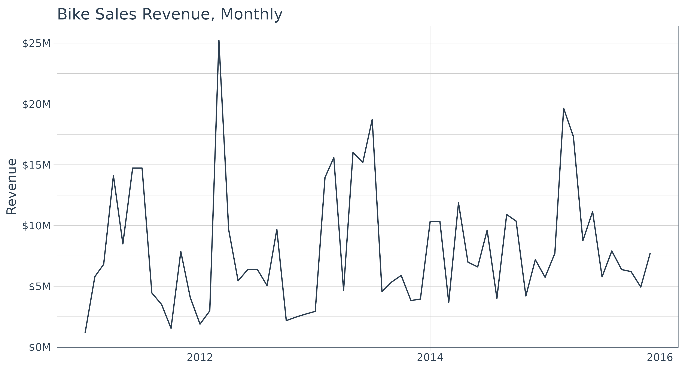
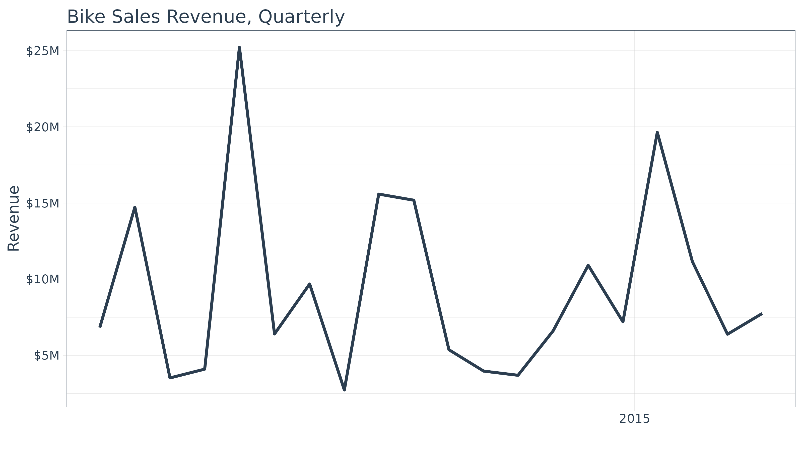
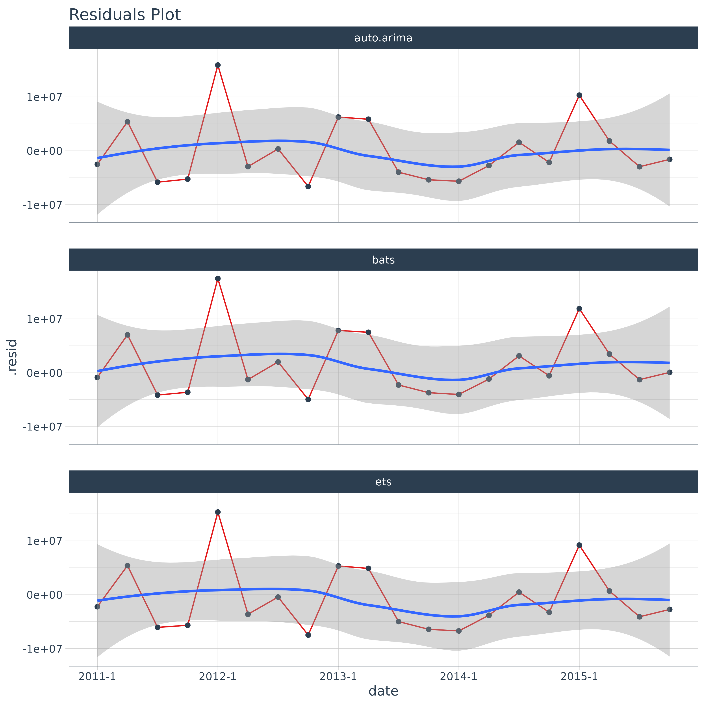
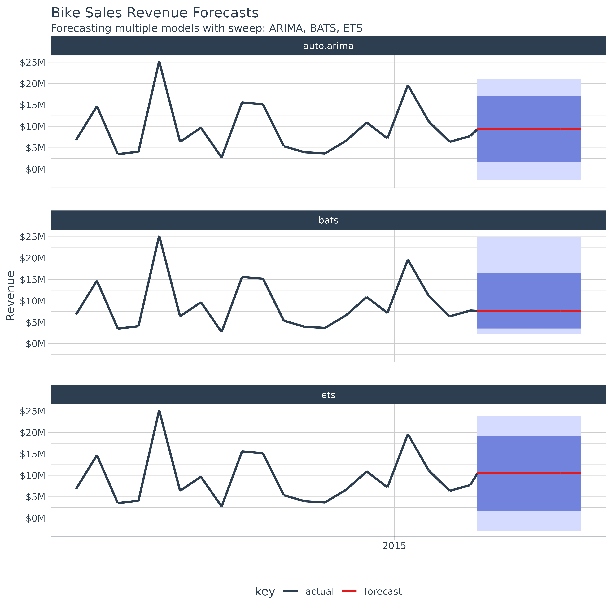

# Forecasting Using Multiple Models

> Extending `broom` to time series forecasting

One of the most powerful benefits of `sweep` is that it helps
forecasting at scale within the “tidyverse”. There are two common
situations:

1.  Applying a model to groups of time series
2.  Applying multiple models to a time series

In this vignette we’ll review how `sweep` can help the **second
situation**: *Applying multiple models to a time series*.

## Prerequisites

Before we get started, load the following packages.

``` r
library(tidyr)
library(dplyr)
library(purrr)
library(lubridate)
library(ggplot2)
library(tidyquant)
library(timetk)
library(sweep)
library(forecast)
```

## Forecasting Bike Sales Revenue

To start, we’ll build a monthly revenue series from the `bike_sales`
data set that ships with `sweep`. To keep the missing-value cleanup step
in the example, we’ll intentionally blank a few monthly observations.

``` r
sales_monthly_raw <- bike_sales %>%
    dplyr::mutate(date = lubridate::floor_date(order.date, unit = "month")) %>%
    dplyr::group_by(date) %>%
    dplyr::summarise(price = sum(price.ext), .groups = "drop") %>%
    dplyr::mutate(price = dplyr::if_else(dplyr::row_number() %in% c(7L, 19L, 38L), NA_real_, price))
sales_monthly_raw
```

    ## # A tibble: 60 × 2
    ##    date          price
    ##    <date>        <dbl>
    ##  1 2011-01-01  1165365
    ##  2 2011-02-01  5794945
    ##  3 2011-03-01  6811655
    ##  4 2011-04-01 14097770
    ##  5 2011-05-01  8488650
    ##  6 2011-06-01 14725405
    ##  7 2011-07-01       NA
    ##  8 2011-08-01  4456670
    ##  9 2011-09-01  3505000
    ## 10 2011-10-01  1548640
    ## # ℹ 50 more rows

Upon a brief inspection, the data contains 3 `NA` values that will need
to be dealt with.

``` r
summary(sales_monthly_raw$price)
```

    ##     Min.  1st Qu.   Median     Mean  3rd Qu.     Max.     NA's 
    ##  1165365  4204590  6394690  7928688 10331390 25227175        3

We can use the
[`fill()`](https://tidyr.tidyverse.org/reference/fill.html) from the
`tidyr` package to help deal with these data. We first fill down and
then fill up to use the previous and then post days prices to fill in
the missing data.

``` r
sales_monthly <- sales_monthly_raw %>%
    fill(price, .direction = "down") %>%
    fill(price, .direction = "up")
```

We can now visualize the data.

``` r
sales_monthly %>%
    ggplot(aes(x = date, y = price)) +
    geom_line(color = palette_light()[[1]]) +
    labs(title = "Bike Sales Revenue, Monthly", x = "", y = "Revenue") +
    scale_y_continuous(labels = scales::label_dollar(scale = 1 / 1000000, suffix = "M")) +
    theme_tq()
```



Monthly periodicity might be a bit granular for model fitting. We can
easily switch periodicity to quarterly using
[`tq_transmute()`](https://business-science.github.io/tidyquant/reference/tq_mutate.html)
from the `tidyquant` package along with the periodicity aggregation
function `to.period` from the `xts` package. We’ll convert the date to
`yearqtr` class which is regularized.

``` r
sales_quarterly <- sales_monthly %>%
    tq_transmute(mutate_fun = to.period, period = "quarters") 
sales_quarterly
```

    ## # A tibble: 20 × 2
    ##    date          price
    ##    <date>        <dbl>
    ##  1 2011-03-01  6811655
    ##  2 2011-06-01 14725405
    ##  3 2011-09-01  3505000
    ##  4 2011-12-01  4081460
    ##  5 2012-03-01 25227175
    ##  6 2012-06-01  6394690
    ##  7 2012-09-01  9678210
    ##  8 2012-12-01  2711705
    ##  9 2013-03-01 15584435
    ## 10 2013-06-01 15182715
    ## 11 2013-09-01  5358180
    ## 12 2013-12-01  3953565
    ## 13 2014-03-01  3678090
    ## 14 2014-06-01  6596090
    ## 15 2014-09-01 10907310
    ## 16 2014-12-01  7190935
    ## 17 2015-03-01 19645635
    ## 18 2015-06-01 11146845
    ## 19 2015-09-01  6377295
    ## 20 2015-12-01  7740870

Another quick visualization to show the reduction in granularity.

``` r
sales_quarterly %>%
    ggplot(aes(x = date, y = price)) +
    geom_line(color = palette_light()[[1]], linewidth = 1) +
    labs(title = "Bike Sales Revenue, Quarterly", x = "", y = "Revenue") +
    scale_y_continuous(labels = scales::label_dollar(scale = 1 / 1000000, suffix = "M")) +
    scale_x_date(date_breaks = "5 years", date_labels = "%Y") +
    theme_tq()
```



## Performing Forecasts Using Multiple Models

In this section we will use three models to forecast bike sales revenue:

1.  ARIMA
2.  ETS
3.  BATS

### Multiple Models Concept

Before we jump into modeling, let’s take a look at the multiple model
process from [R for Data Science, Chapter 25 Many
Models](https://r4ds.had.co.nz/many-models.html#from-a-named-list). We
first create a data frame from a named list. The example below has two
columns: “f” the functions as text, and “params” a nested list of
parameters we will pass to the respective function in column “f”.

``` r
df <- tibble(
  f = c("runif", "rpois", "rnorm"),
  params = list(
    list(n = 10),
    list(n = 5, lambda = 10),
    list(n = 10, mean = -3, sd = 10)
  )
)
df
```

    ## # A tibble: 3 × 2
    ##   f     params          
    ##   <chr> <list>          
    ## 1 runif <named list [1]>
    ## 2 rpois <named list [2]>
    ## 3 rnorm <named list [3]>

We can also view the contents of the `df$params` column to understand
the underlying structure. Notice that there are three primary levels and
then secondary levels containing the name-value pairs of parameters.
This format is important.

``` r
df$params
```

    ## [[1]]
    ## [[1]]$n
    ## [1] 10
    ## 
    ## 
    ## [[2]]
    ## [[2]]$n
    ## [1] 5
    ## 
    ## [[2]]$lambda
    ## [1] 10
    ## 
    ## 
    ## [[3]]
    ## [[3]]$n
    ## [1] 10
    ## 
    ## [[3]]$mean
    ## [1] -3
    ## 
    ## [[3]]$sd
    ## [1] 10

Next we apply the functions to the parameters using a special function,
[`invoke_map()`](https://purrr.tidyverse.org/reference/invoke.html). The
parameter lists in the “params” column are passed to the function in the
“f” column. The output is in a nested list-column named “out”.

``` r
# FIXME invoke_map is deprecated
df_out <- df %>% 
    mutate(out = invoke_map(f, params))
```

    ## Warning: There were 2 warnings in `mutate()`.
    ## The first warning was:
    ## ℹ In argument: `out = invoke_map(f, params)`.
    ## Caused by warning:
    ## ! `invoke_map()` was deprecated in purrr 1.0.0.
    ## ℹ Please use map() + exec() instead.
    ## ℹ Run `dplyr::last_dplyr_warnings()` to see the 1 remaining warning.

``` r
df_out
```

    ## # A tibble: 3 × 3
    ##   f     params           out       
    ##   <chr> <list>           <list>    
    ## 1 runif <named list [1]> <dbl [10]>
    ## 2 rpois <named list [2]> <int [5]> 
    ## 3 rnorm <named list [3]> <dbl [10]>

And, here’s the contents of “out”, which is the result of mapping a list
of functions to a list of parameters. Pretty powerful!

``` r
df_out$out
```

    ## [[1]]
    ##  [1] 0.080750138 0.834333037 0.600760886 0.157208442 0.007399441 0.466393497
    ##  [7] 0.497777389 0.289767245 0.732881987 0.772521511
    ## 
    ## [[2]]
    ## [1] 13  4  7  9  8
    ## 
    ## [[3]]
    ##  [1]   3.289820  17.650249 -19.309894   2.124269 -21.630115  -8.220125
    ##  [7]  -3.526019   2.429963 -12.140748   1.681544

Take a minute to understand the conceptual process of the `invoke_map`
function and specifically the parameter setup. Once you are comfortable,
we can move on to model implementation.

### Multiple Model Implementation

We’ll need to take the following steps to in an actual forecast model
implementation:

1.  Coerce the data to time series
2.  Build a model list using nested lists
3.  Create the the model data frame
4.  Invoke a function map

This is easier than it sounds. Let’s start by coercing the univariate
time series with
[`tk_ts()`](https://business-science.github.io/timetk/reference/tk_ts.html).

``` r
sales_quarterly_ts <- sales_quarterly %>% 
    tk_ts(select = -date, start = c(2011, 1), freq = 4)
sales_quarterly_ts
```

    ##          Qtr1     Qtr2     Qtr3     Qtr4
    ## 2011  6811655 14725405  3505000  4081460
    ## 2012 25227175  6394690  9678210  2711705
    ## 2013 15584435 15182715  5358180  3953565
    ## 2014  3678090  6596090 10907310  7190935
    ## 2015 19645635 11146845  6377295  7740870

Next, create a nested list using the function names as the first-level
keys (this is important as you’ll see in the next step). Pass the model
parameters as name-value pairs in the second level.

``` r
models_list <- list(
    auto.arima = list(
        y = sales_quarterly_ts
        ),
    ets = list(
        y = sales_quarterly_ts,
        damped = TRUE
    ),
    bats = list(
        y = sales_quarterly_ts
    )
)
```

Now, convert to a data frame using the function, `enframe()` that turns
lists into tibbles. Set the arguments `name = "f"` and
`value = "params"`. In doing so we get a bonus: the model names are the
now conveniently located in column “f”.

``` r
models_tbl <- tibble::enframe(models_list, name = "f", value = "params")
models_tbl
```

    ## # A tibble: 3 × 2
    ##   f          params          
    ##   <chr>      <list>          
    ## 1 auto.arima <named list [1]>
    ## 2 ets        <named list [2]>
    ## 3 bats       <named list [1]>

We are ready to invoke the map. Combine
[`mutate()`](https://dplyr.tidyverse.org/reference/mutate.html) with
[`invoke_map()`](https://purrr.tidyverse.org/reference/invoke.html) as
follows. Bada bing, bada boom, we now have models fitted using the
parameters we defined previously.

``` r
models_tbl_fit <- models_tbl %>%
    mutate(fit = purrr::invoke_map(f, params))
models_tbl_fit
```

    ## # A tibble: 3 × 3
    ##   f          params           fit       
    ##   <chr>      <list>           <list>    
    ## 1 auto.arima <named list [1]> <fc_model>
    ## 2 ets        <named list [2]> <fc_model>
    ## 3 bats       <named list [1]> <fc_model>

## Inspecting the Model Fit

It’s a good point to review and understand the model output. We can
review the model parameters, accuracy measurements, and the residuals
using
[`sw_tidy()`](https://business-science.github.io/sweep/reference/sw_tidy.md),
[`sw_glance()`](https://business-science.github.io/sweep/reference/sw_glance.md),
and
[`sw_augment()`](https://business-science.github.io/sweep/reference/sw_augment.md).

### sw_tidy

The tidying function returns the model parameters and estimates. We use
the combination of `mutate` and `map` to iteratively apply the
[`sw_tidy()`](https://business-science.github.io/sweep/reference/sw_tidy.md)
function as a new column named “tidy”. Then we unnest and spread to
review the terms by model function.

``` r
models_tbl_fit %>%
    mutate(tidy = map(fit, sw_tidy)) %>%
    unnest(tidy) %>%
    spread(key = f, value = estimate)
```

    ## # A tibble: 13 × 6
    ##    params           fit        term              auto.arima        bats      ets
    ##    <list>           <list>     <chr>                  <dbl>       <dbl>    <dbl>
    ##  1 <named list [1]> <fc_model> intercept           9324863. NA          NA      
    ##  2 <named list [1]> <fc_model> alpha                    NA  -0.01000    NA      
    ##  3 <named list [1]> <fc_model> ar.coefficients          NA  NA          NA      
    ##  4 <named list [1]> <fc_model> beta                     NA  NA          NA      
    ##  5 <named list [1]> <fc_model> damping.parameter        NA  NA          NA      
    ##  6 <named list [1]> <fc_model> gamma.values             NA  NA          NA      
    ##  7 <named list [1]> <fc_model> lambda                   NA   0.00000521 NA      
    ##  8 <named list [1]> <fc_model> ma.coefficients          NA  NA          NA      
    ##  9 <named list [2]> <fc_model> alpha                    NA  NA           1.00e-4
    ## 10 <named list [2]> <fc_model> b                        NA  NA           4.57e+5
    ## 11 <named list [2]> <fc_model> beta                     NA  NA           1.00e-4
    ## 12 <named list [2]> <fc_model> l                        NA  NA           8.67e+6
    ## 13 <named list [2]> <fc_model> phi                      NA  NA           8.00e-1

### sw_glance

Glance is one of the most powerful tools because it yields the model
accuracies enabling direct comparisons between the fit of each model. We
use the same process for used for tidy, except theres no need to spread
to perform the comparison. We can see that the ARIMA model has the
lowest AIC by far.

``` r
models_tbl_fit %>%
    mutate(glance = map(fit, sw_glance)) %>%
    unnest(glance, .drop = TRUE)
```

    ## Warning: The `.drop` argument of `unnest()` is deprecated as of tidyr 1.0.0.
    ## ℹ All list-columns are now preserved.
    ## Call `lifecycle::last_lifecycle_warnings()` to see where this warning was
    ## generated.

    ## # A tibble: 3 × 15
    ##   f        params       fit        model.desc   sigma logLik   AIC   BIC      ME
    ##   <chr>    <list>       <list>     <chr>        <dbl>  <dbl> <dbl> <dbl>   <dbl>
    ## 1 auto.ar… <named list> <fc_model> ARIMA(0,0… 6.02e+6  -340.  684.  686.  0     
    ## 2 ets      <named list> <fc_model> ETS(A,Ad,… 6.86e+6  -342.  696.  702. -8.06e5
    ## 3 bats     <named list> <fc_model> BATS(0, {… 6.02e-1   674.  680.  682.  1.64e6
    ## # ℹ 6 more variables: RMSE <dbl>, MAE <dbl>, MPE <dbl>, MAPE <dbl>, MASE <dbl>,
    ## #   ACF1 <dbl>

### sw_augment

We can augment the models to get the residuals following the same
procedure. We can pipe (`%>%`) the results right into
[`ggplot()`](https://ggplot2.tidyverse.org/reference/ggplot.html) for
plotting. Notice the ARIMA model has the largest residuals especially as
the model index increases whereas the bats model has relatively low
residuals.

``` r
models_tbl_fit %>%
    mutate(augment = map(fit, sw_augment, rename_index = "date")) %>%
    unnest(augment) %>%
    ggplot(aes(x = date, y = .resid, group = f)) +
    geom_line(color = palette_light()[[2]]) +
    geom_point(color = palette_light()[[1]]) +
    geom_smooth(method = "loess") +
    facet_wrap(~ f, nrow = 3) +
    labs(title = "Residuals Plot") +
    theme_tq()
```

    ## `geom_smooth()` using formula = 'y ~ x'



## Forecasting the model

Creating the forecast for the models is accomplished by mapping the
`forecast` function. The next six quarters are forecasted withe the
argument `h = 6`.

``` r
models_tbl_fcast <- models_tbl_fit %>%
    mutate(fcast = map(fit, forecast, h = 6))
models_tbl_fcast
```

    ## # A tibble: 3 × 4
    ##   f          params           fit        fcast     
    ##   <chr>      <list>           <list>     <list>    
    ## 1 auto.arima <named list [1]> <fc_model> <forecast>
    ## 2 ets        <named list [2]> <fc_model> <forecast>
    ## 3 bats       <named list [1]> <fc_model> <forecast>

## Tidying the forecast

Next, we map `sw_sweep`, which coerces the forecast into the “tidy”
tibble format. We set `fitted = FALSE` to remove the model fitted values
from the output. We set `timetk_idx = TRUE` to use dates instead of
numeric values for the index.

``` r
models_tbl_fcast_tidy <- models_tbl_fcast %>%
    mutate(sweep = map(fcast, sw_sweep, fitted = FALSE, timetk_idx = TRUE, rename_index = "date"))
```

    ## Warning: There were 3 warnings in `mutate()`.
    ## The first warning was:
    ## ℹ In argument: `sweep = map(fcast, sw_sweep, fitted = FALSE, timetk_idx = TRUE,
    ##   rename_index = "date")`.
    ## Caused by warning in `.check_tzones()`:
    ## ! 'tzone' attributes are inconsistent
    ## ℹ Run `dplyr::last_dplyr_warnings()` to see the 2 remaining warnings.

``` r
models_tbl_fcast_tidy
```

    ## # A tibble: 3 × 5
    ##   f          params           fit        fcast      sweep            
    ##   <chr>      <list>           <list>     <list>     <list>           
    ## 1 auto.arima <named list [1]> <fc_model> <forecast> <tibble [26 × 7]>
    ## 2 ets        <named list [2]> <fc_model> <forecast> <tibble [26 × 7]>
    ## 3 bats       <named list [1]> <fc_model> <forecast> <tibble [26 × 7]>

We can unnest the “sweep” column to get the results of all three models.

``` r
models_tbl_fcast_tidy %>%
    unnest(sweep)
```

    ## # A tibble: 78 × 11
    ##    f      params       fit        fcast      date       key    price lo.80 lo.95
    ##    <chr>  <list>       <list>     <list>     <date>     <chr>  <dbl> <dbl> <dbl>
    ##  1 auto.… <named list> <fc_model> <forecast> 2011-03-01 actu… 6.81e6    NA    NA
    ##  2 auto.… <named list> <fc_model> <forecast> 2011-06-01 actu… 1.47e7    NA    NA
    ##  3 auto.… <named list> <fc_model> <forecast> 2011-09-01 actu… 3.51e6    NA    NA
    ##  4 auto.… <named list> <fc_model> <forecast> 2011-12-01 actu… 4.08e6    NA    NA
    ##  5 auto.… <named list> <fc_model> <forecast> 2012-03-01 actu… 2.52e7    NA    NA
    ##  6 auto.… <named list> <fc_model> <forecast> 2012-06-01 actu… 6.39e6    NA    NA
    ##  7 auto.… <named list> <fc_model> <forecast> 2012-09-01 actu… 9.68e6    NA    NA
    ##  8 auto.… <named list> <fc_model> <forecast> 2012-12-01 actu… 2.71e6    NA    NA
    ##  9 auto.… <named list> <fc_model> <forecast> 2013-03-01 actu… 1.56e7    NA    NA
    ## 10 auto.… <named list> <fc_model> <forecast> 2013-06-01 actu… 1.52e7    NA    NA
    ## # ℹ 68 more rows
    ## # ℹ 2 more variables: hi.80 <dbl>, hi.95 <dbl>

Finally, we can plot the forecasts by unnesting the “sweep” column and
piping to
[`ggplot()`](https://ggplot2.tidyverse.org/reference/ggplot.html).

``` r
models_tbl_fcast_tidy %>%
    unnest(sweep) %>%
    ggplot(aes(x = date, y = price, color = key, group = f)) +
    geom_ribbon(aes(ymin = lo.95, ymax = hi.95), 
                fill = "#D5DBFF", color = NA, linewidth = 0) +
    geom_ribbon(aes(ymin = lo.80, ymax = hi.80, fill = key), 
                fill = "#596DD5", color = NA, linewidth = 0, alpha = 0.8) +
    geom_line(linewidth = 1) +
    facet_wrap(~f, nrow = 3) +
    labs(title = "Bike Sales Revenue Forecasts",
         subtitle = "Forecasting multiple models with sweep: ARIMA, BATS, ETS",
         x = "", y = "Revenue") +
    scale_y_continuous(labels = scales::label_dollar(scale = 1 / 1000000, suffix = "M")) +
    scale_x_date(date_breaks = "5 years", date_labels = "%Y") +
    theme_tq() +
    scale_color_tq()
```

    ## Warning: Removed 60 rows containing missing values or values outside the scale range
    ## (`geom_ribbon()`).
    ## Removed 60 rows containing missing values or values outside the scale range
    ## (`geom_ribbon()`).



## Recap

The `sweep` package can aid analysis of multiple forecast models. In the
next vignette we will review time series object coercion with `sweep`.
