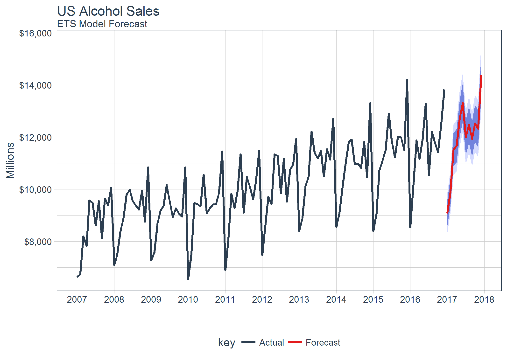
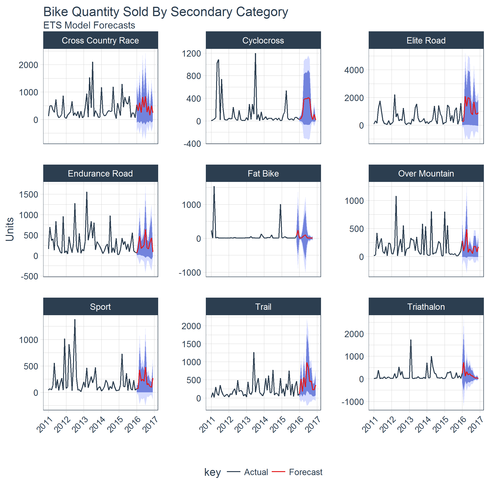
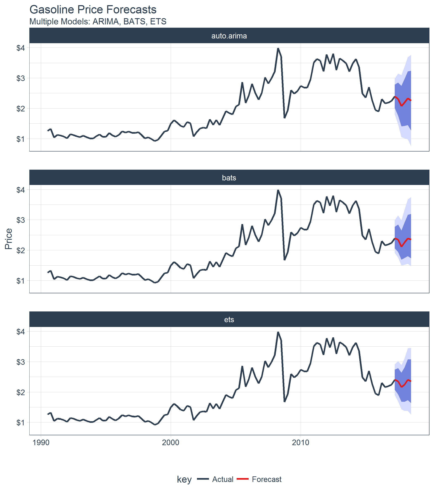

# sweep

> Extending `broom` to time series forecasting

The `sweep` package extends the `broom` tools (tidy, glance, and
augment) for performing forecasts and time series analysis in the
“tidyverse”. The package is geared towards “tidying” the forecast
workflow used with Rob Hyndman’s `forecast` package.

## Benefits

- **Designed for modeling and scaling forecasts using the the
  `tidyverse` tools in [*R for Data Science*](https://r4ds.hadley.nz/)**
- **Extends `broom` for model analysis (ARIMA, ETS, BATS, etc)**
- **Tidies the `forecast` objects for easy plotting and “tidy” data
  manipulation**
- **Integrates `timetk` to enable dates and datetimes (irregular time
  series) in the tidied forecast output**

## Tools

The package contains the following elements:

1.  **model tidiers**: `sw_tidy`, `sw_glance`, `sw_augment`,
    `sw_tidy_decomp` functions extend `tidy`, `glance`, and `augment`
    from the `broom` package specifically for models (`ets()`,
    `Arima()`, `bats()`, etc) used for forecasting.

2.  **forecast tidier**: `sw_sweep` converts a `forecast` object to a
    tibble that can be easily manipulated in the “tidyverse”.

## Making forecasts in the tidyverse

`sweep` enables converting a `forecast` object to `tibble`. The result
is ability to use `dplyr`, `tidyr`, and `ggplot` natively to manipulate,
analyze and visualize forecasts.



## Forecasting multiple time series groups at scale

Often forecasts are required on grouped data to analyse trends in
sub-categories. The good news is scaling from one time series to many is
easy with the various `sw_` functions in combination with `dplyr` and
`purrr`.



## Forecasting multiple models for accuracy

A common goal in forecasting is to compare different forecast models
against each other. `sweep` helps in this area as well.



## broom extensions for forecasting

If you are familiar with `broom`, you know how useful it is for
retrieving “tidy” format model components. `sweep` extends this benefit
to the `forecast` package workflow with the following functions:

- `sw_tidy`: Returns model coefficients (single column)
- `sw_glance`: Returns accuracy statistics (single row)
- `sw_augment`: Returns residuals
- `sw_tidy_decomp`: Returns seasonal decompositions
- `sw_sweep`: Returns tidy forecast outputs.

The compatibility chart is listed below.

| Object      | sw_tidy() | sw_glance() | sw_augment() | sw_tidy_decomp() | sw_sweep() |
|:------------|:---------:|:-----------:|:------------:|:----------------:|:----------:|
| ar          |           |             |              |                  |            |
| arima       |     X     |      X      |      X       |                  |            |
| Arima       |     X     |      X      |      X       |                  |            |
| ets         |     X     |      X      |      X       |        X         |            |
| baggedETS   |           |             |              |                  |            |
| bats        |     X     |      X      |      X       |        X         |            |
| tbats       |     X     |      X      |      X       |        X         |            |
| nnetar      |     X     |      X      |      X       |                  |            |
| stl         |           |             |              |        X         |            |
| HoltWinters |     X     |      X      |      X       |        X         |            |
| StructTS    |     X     |      X      |      X       |        X         |            |
| tslm        |     X     |      X      |      X       |                  |            |
| decompose   |           |             |              |        X         |            |
| adf.test    |     X     |      X      |              |                  |            |
| Box.test    |     X     |      X      |              |                  |            |
| kpss.test   |     X     |      X      |              |                  |            |
| forecast    |           |             |              |                  |     X      |

Function Compatibility

## Installation

Here’s how to get started.

Development version with latest features:

``` r
# install.packages("remotes")
remotes::install_github("business-science/sweep")
```

## Further Information

The `sweep` package includes several vignettes to help users get up to
speed quickly:

- SW00 - Introduction to `sweep`
- SW01 - Forecasting Time Series Groups in the tidyverse
- SW02 - Forecasting Using Multiple Models
